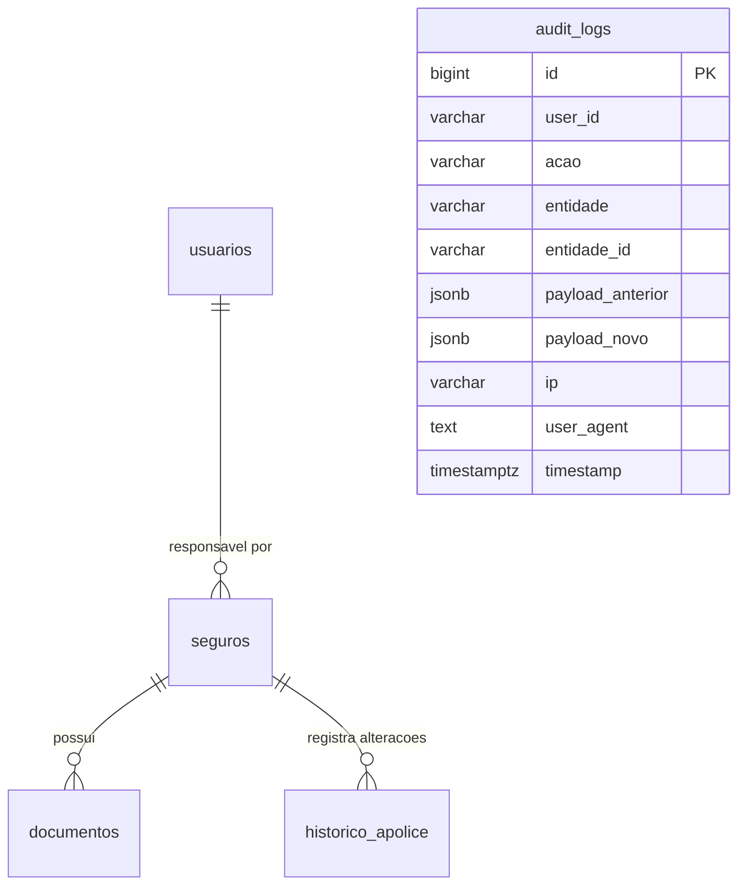
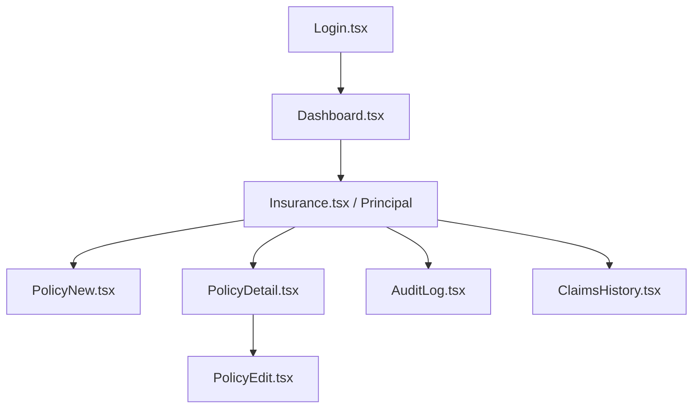

# 📄 Dossiê Técnico de Contexto: Sistema de Gestão de Apólices de Seguros (SGAS)

Este dossiê reúne todo o contexto técnico, de negócios, de banco de dados e arquitetura de software extraído diretamente do código-fonte do projeto. Ele foi estruturado como uma fonte de verdade para apoiar a criação e refinamento dos 4 pacotes de trabalho (Requisitos, Design, Testes e Gerência).

---

## 🏢 1. Contexto do Negócio e Conceito de Domínio

### O que é o SGAS?
O **SGAS** é uma plataforma corporativa desenvolvida para a administradora de um empreendimento comercial (como um Shopping Center) controlar a conformidade das apólices de seguro obrigatórias exigidas das **LUCs (Lojas de Uso Comercial)**. O sistema gerencia um portfólio robusto de apólices com mais de **R$ 400 Milhões em cobertura total sob gestão**, tornando o compliance regulatório um pilar crítico de segurança patrimonial.

### Conceitos-Chave:
- **LUC (Loja de Uso Comercial):** Identificador exclusivo (ex: "LUC-101", "LUC-A") de um espaço físico comercial que deve possuir apólices ativas.
- **Conformidade (Compliance):** Situação de regularidade da apólice da loja perante as regras do empreendimento.
- **Trilha de Auditoria (Audit Log):** Registro histórico imutável das ações operacionais para atender requisitos de governança.

---

## 🗄️ 2. Modelo de Dados (Schema PostgreSQL)

O banco de dados é estruturado sobre 5 tabelas principais, implementadas via migrations no PostgreSQL:

### 1. Tabela `usuarios`
Registra os operadores internos e analistas da administradora.
- `id` (SERIAL, PK): Identificador do usuário.
- `nome` (VARCHAR(255)): Nome completo do usuário.
- `email` (VARCHAR(255), UNIQUE): E-mail do usuário.
- `created_at` (TIMESTAMP): Data de criação da conta.

### 2. Tabela `seguros` (Apólices)
Armazena a apólice ativa associada a cada loja (`luc`).
- `luc` (VARCHAR, PK): Identificador da unidade comercial.
- `loja` (VARCHAR): Nome fantasia do lojista.
- `segmento` (VARCHAR): Tipo/ramo da atividade (ex: Vestuário, Alimentação, Serviços).
- `seguradora` (VARCHAR): Nome da seguradora emissora.
- `vigencia` (DATE): Data de início de vigência da apólice.
- `vencimento` (DATE): Data de expiração da apólice.
- `status` (VARCHAR): Calculado dinamicamente no backend com base no vencimento.
- `cobertura` (NUMERIC): Limite de cobertura contratado.
- `responsavel` (VARCHAR): Nome do analista responsável.
- `responsavel_id` (BIGINT, FK -> usuarios.id): Vínculo com o analista interno.
- `observacoes` (TEXT): Notas e pareceres da auditoria.
- `deleted_at` (TIMESTAMP, NULL): Controle de exclusão lógica (soft delete).

### 3. Tabela `documentos`
Armazena os arquivos digitais de apólices em PDF vinculados a cada seguro.
- `id` (SERIAL, PK)
- `apolice_luc` (VARCHAR(50), FK -> seguros.luc)
- `nome` (VARCHAR(255)): Nome do arquivo PDF.
- `arquivo_path` (VARCHAR(500)): Caminho físico/URL do arquivo no servidor.
- `data_adicao` (TIMESTAMP): Data do upload.

### 4. Tabela `historico_apolice`
Histórico de eventos específicos de cada apólice (renovação, edição, etc.).
- `id` (SERIAL, PK)
- `apolice_luc` (VARCHAR(50))
- `data` (TIMESTAMP): Registro de data/hora do evento.
- `descricao` (TEXT): Texto descritivo da ação realizada.
- `ator` (VARCHAR(255)): Nome do operador responsável pela ação.

### 5. Tabela `audit_logs` (Imutável)
Registra todas as ações e mutações de estados nas entidades da API para auditoria de compliance corporativo.
- **Regra Crítica:** A tabela **não permite UPDATE nem DELETE** (garantido em banco via regras ou permissões `REVOKE` em produção).
- Possui índices compostos nos campos `timestamp DESC`, `acao`, `entidade` e `user_id` para otimização de relatórios.

---

## ⚡ 3. Regras de Negócio Implementadas no Backend

### A. Lógica de Status da Apólice
O status da apólice é derivado no backend através dos dias restantes para o vencimento:
$$\text{Dias Restantes} = \text{Vencimento} - \text{Hoje}$$

- **Vencida:** Se $\text{Dias Restantes} < 0$.
- **A Vencer:** Se $0 \le \text{Dias Restantes} \le 15$ dias.
- **Ativa (Conforme):** Se $\text{Dias Restantes} > 15$ dias.

### B. Lógica da Fila de Ação (Priorização de Risco)
Para priorizar as ações de cobrança aos lojistas não conformes, o backend calcula um **Score de Urgência** que combina a magnitude da cobertura financeira exposta com o fator temporal de atraso:

$$Score = \text{Valor da Cobertura} \times Risco$$

Onde a variável $Risco$ é definida por:
- **Se vencida ($\text{Dias Restantes} < 0$):** $Risco = 100 + |\text{Dias Restantes}|$ (Cresce a cada dia de atraso).
- **Se a vencer ou ativa ($\text{Dias Restantes} \ge 0$):** $Risco = \max(1, 100 - \text{Dias Restantes})$.
*O painel exibe as 10 apólices com maior score de urgência de forma decrescente.*

---

## 📞 4. Catálogo de APIs (Endpoints)

### Coleção de Apólices
- `GET /api/apolices` - Lista todas as apólices (com paginação e filtros de status/pesquisa).
- `POST /api/apolices` - Cria uma nova apólice.
- `GET /api/apolices/{id}` - Detalhes de uma apólice específica.
- `PUT /api/apolices/{id}` - Atualização completa de dados.
- `DELETE /api/apolices/{id}` - Exclusão lógica (soft delete).

### Ações Rápidas e Fluxos Especiais
- `POST /api/apolices/{id}/renovar` - Renova a vigência da apólice informando nova vigência e novo valor.
- `PATCH /api/apolices/{id}/observacoes` - Atualiza observações administrativas sem alterar a apólice.
- `PATCH /api/apolices/{id}/responsavel` - Altera o analista interno responsável pelo acompanhamento.

### KPIs e Métricas
- `GET /api/kpis/history` - Histórico semanal de conformidade e de apólices vencidas (para construção de gráficos de linha/área).
- `GET /api/kpis/expiring-by-week` - Totalizadores de apólices com vencimento na semana vigente.
- `GET /api/kpis/coverage-history` - Histórico de valores contratados vs. sinistros pagos.
- `GET /api/kpis/risk-by-segment` - Gráfico de rosca distribuindo riscos financeiros por segmento comercial.
- `GET /api/kpis/health-score` - Pontuação geral de integridade de risco da carteira de seguros do shopping.
- `GET /api/fila-de-acao` - Retorna as apólices críticas ordenadas pelo Score de Risco.

### Documentos e Anexos
- `GET /api/apolices/{id}/documentos` - Lista os PDFs anexados à apólice.
- `POST /api/apolices/{id}/documentos` - Envio (Upload) do PDF físico da apólice de seguro.
- `GET /api/documentos/{id}/download` - Baixa o PDF anexado.

---

## 🎨 5. Fluxo de Navegação e Componentes (Frontend)

O frontend React é estruturado de forma responsiva, compatível com Dark Mode e projetado sob os seguintes caminhos e páginas:

### Principais Componentes e suas decisões de Interface:
1. **ComplianceMapV2 (Mapa Interativo):**
   - Renderiza a planta baixa das LUCs.
   - Pinta o contorno das lojas baseando-se no status de seguro: verde (Ativa/Conforme), amarelo (A Vencer) e vermelho (Vencida).
   - Permite interação ao clicar na loja para abrir o painel lateral com detalhes.
2. **ActionQueuePanel (Painel da Fila de Ação):**
   - Lista lateral ou em aba com as ações mais urgentes, exibindo o lojista, o score de risco e opções de contato rápido para cobrança de regularização.
3. **SegmentRiskChart (Gráficos Recharts):**
   - Exibe a distribuição de risco financeiro dividida por segmentos comerciais (Alimentação, Moda, Serviços, etc.), auxiliando os administradores a entenderem quais categorias de lojas trazem maior risco de subcobertura.
4. **Filtros Avançados:**
   - Barra superior com filtros de Status, Segmento (Tipo), Seguradora, Data de Vigência e Data de Vencimento, permitindo exportações rápidas em formatos **PDF, CSV e XLSX**.
5. **Modo Foco e Apresentação:**
   - Permite alternar a visualização para otimizar exibições em salas de reuniões e relatórios executivos.
