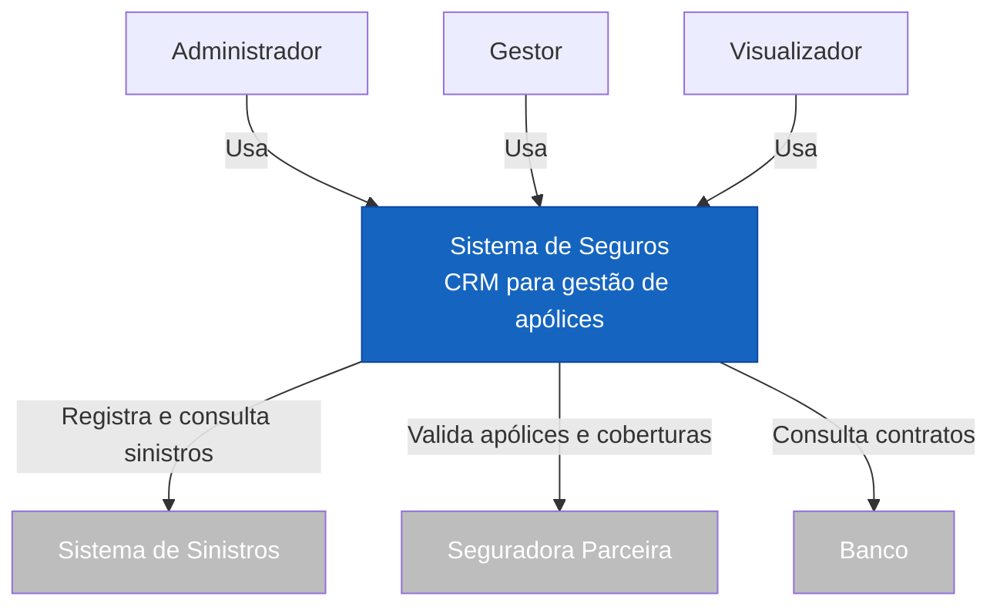
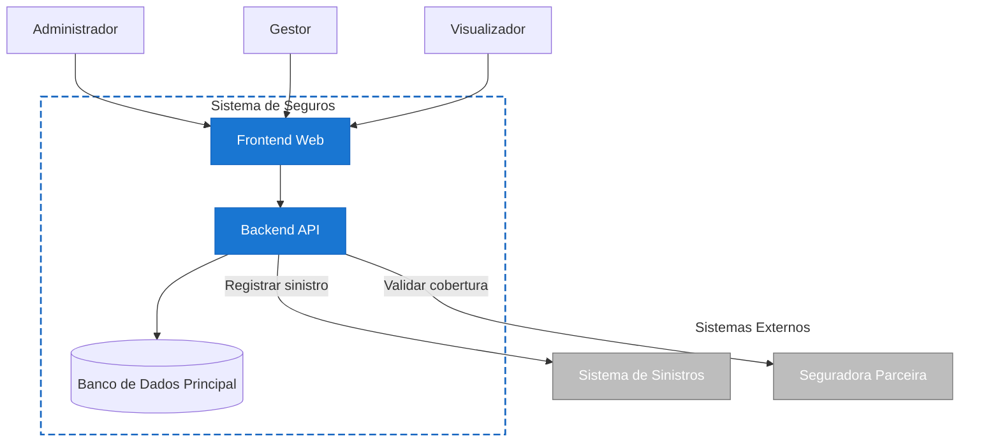
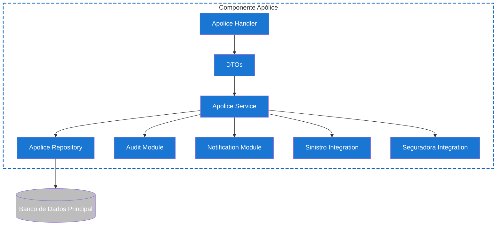
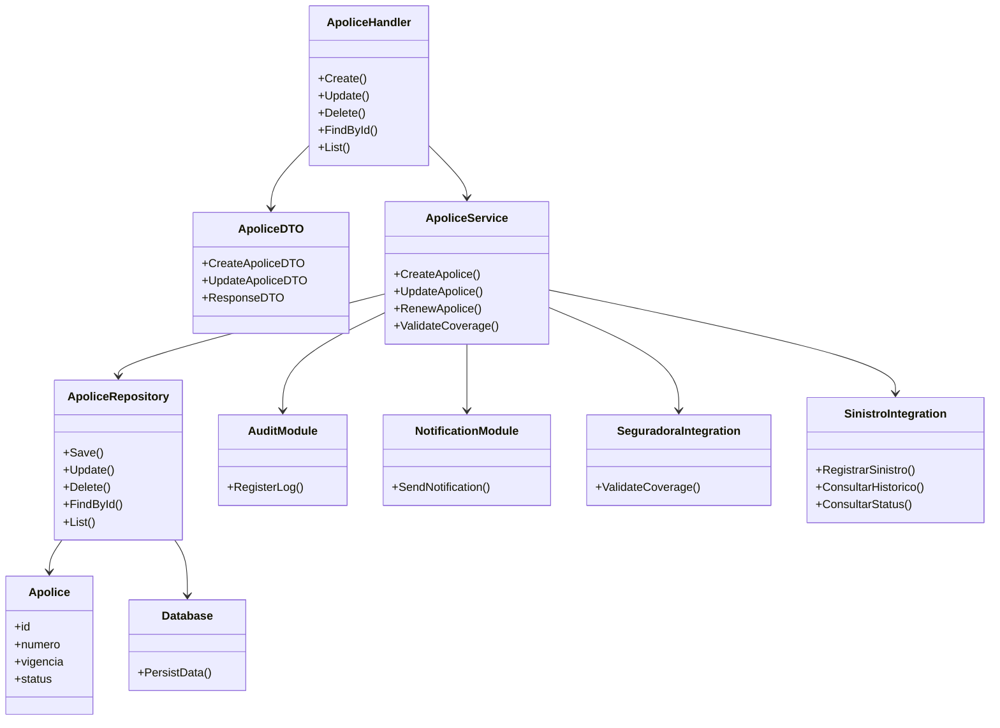

#  Sistema de Seguros - Arquitetura C4 Model

##  Visão Geral

O Sistema de Seguros é uma plataforma responsável pelo gerenciamento das apólices de seguros do shopping, centralizando informações relacionadas a contratos, documentos, auditorias, notificações e indicadores operacionais.

A arquitetura foi documentada utilizando o C4 Model

---

# Nível 1 — Contexto do Sistema

## Objetivo

O Diagrama de Contexto apresenta uma visão macro do sistema, identificando os usuários que interagem com a plataforma e os sistemas externos que participam do ecossistema.

## Usuários

### Administrador

Responsável pelo gerenciamento completo da plataforma.

### Gestor

Responsável pela criação, edição e renovação das apólices.

### Visualizador / Logista

Perfil com acesso somente leitura.

## Sistemas Externos

### Sistema de Sinistros

Sistema mantido por outro grupo responsável pela abertura, acompanhamento e regulação de sinistros.

### Seguradora Parceira

Responsável pela validação e cobertura das apólices.

## Diagrama

---

# Nível 2 — Containers

## Objetivo

O Diagrama de Containers apresenta os principais blocos executáveis que compõem a solução.

## Containers

### Frontend Web

Interface utilizada pelos usuários.

### Backend API

Responsável pela lógica de negócio, integrações e processamento das operações.

### Banco de Dados Principal

Responsável pela persistência dos dados da aplicação.

## Diagrama

---

# Nível 3 — Componentes

## Objetivo

O Diagrama de Componentes detalha a estrutura interna da Backend API.

## Componentes

### Routes

Mapeamento dos endpoints.

### Auth Module

Autenticação e autorização.

### Apolice Handler

Recebe as requisições HTTP.

### Apolice Service

Contém as regras de negócio.

### Apolice Repository

Camada de persistência.

### Document Module

Gerenciamento documental.

### Notification Module

Notificações.

### Audit Module

Auditoria.

### KPI Module

Indicadores e dashboards.

### Integrações

- Sinistro Integration
- Seguradora Integration

## Diagrama

# Nível 4 — Código

## Objetivo

Este nível detalha o componente Apolice Service, núcleo das regras de negócio da aplicação.

## Diagrama

---

---

# Fechamento

A modelagem arquitetural utilizando o C4 Model permite melhor compreensão em relação ao Sistema de Seguros.

